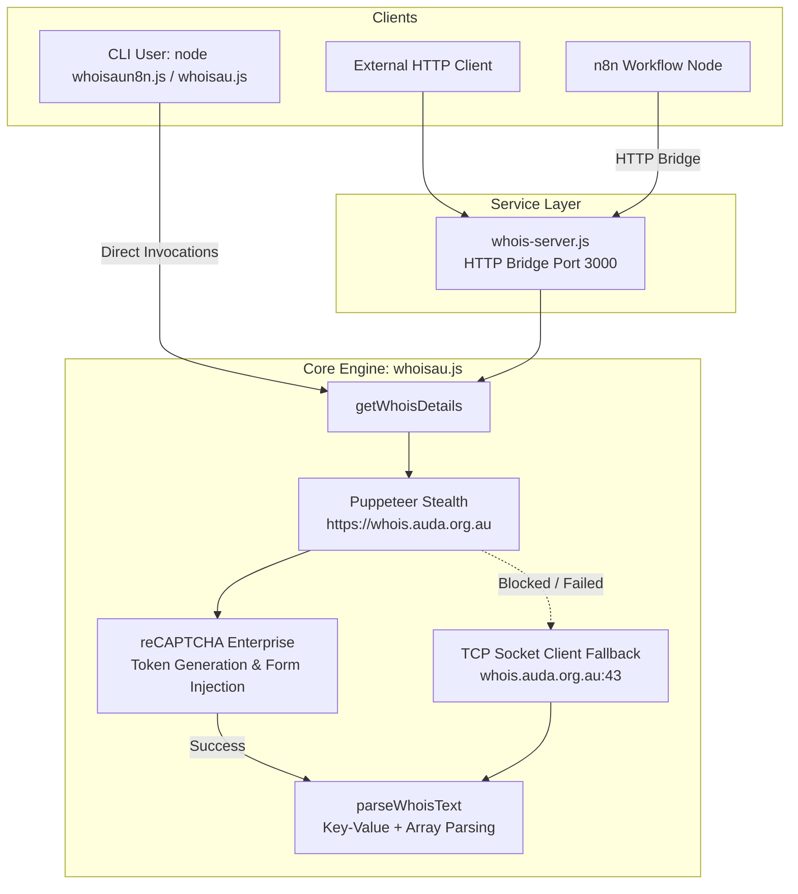

# GEMINI.md - WhoIsAU Project Context & Architectural Guide

## Project Overview

**WhoIsAU** is a specialized Node.js data extraction and enrichment toolkit designed to query, parse, and structure registration details for Australian (`.au`) top-level domains (including `.com.au`, `.net.au`, `.org.au`, etc.).

### The Problem Domain

Australian domain registration is governed by **auDA** (au Domain Administration). Accessing registrant and contact details presents several barriers:
1. **Web WHOIS (`whois.auda.org.au`)**: Protected behind Google reCAPTCHA Enterprise. While this source exposes vital contact emails (e.g., Tech/Registrant Contact Email), automated scraping is blocked by default without stealth execution and CAPTCHA token resolution.
2. **Direct TCP Port 43 (`whois.auda.org.au:43`)**: Faster and headless-friendly, but subjects clients to strict rate limits and often redacts or withholds direct email addresses.
3. **Official RDAP API (`rdap.cctld.au`)**: Modern, open JSON standard returning clean eligibility data (Registrant Name, ABN/ACN Registrant ID, Eligibility Type), but omits direct registrant contact emails due to privacy policies.

**WhoIsAU** solves these limitations through a resilient, multi-tiered architecture that combines headless browser automation with reCAPTCHA bypass, direct TCP socket fallback, official RDAP queries, and website email scraping.

---

## High-Level Architecture & Workflow



---

## Codebase File Map

| File | Type | Description |
| :--- | :--- | :--- |
| [`whoisau.js`](file:///c:/Users/SpartaPc/Documents/VSCODE/WhoIsAU/whoisau.js) | Core Module / CLI | Main extraction library. Automates Puppeteer stealth navigation, generates reCAPTCHA Enterprise tokens, queries port 43 TCP sockets on fallback, and parses WHOIS text responses. |
| [`whois-server.js`](file:///c:/Users/SpartaPc/Documents/VSCODE/WhoIsAU/whois-server.js) | Microservice | Zero-dependency native Node.js HTTP server exposing `GET /whois?domain=...`. Provides CORS support and acts as a bridge for n8n or external webhooks. |
| [`whoisaun8n.js`](file:///c:/Users/SpartaPc/Documents/VSCODE/WhoIsAU/whoisaun8n.js) | Dual Script / n8n Node | Universal runner. Works as both a CLI tool (`node whoisaun8n.js <domain>`) outputting clean JSON, and as an n8n Code node script (JavaScript, "Run Once for All Items"). Implements the 3-tier waterfall enrichment: Bridge Server &rarr; auDA RDAP &rarr; Website Scraper. |
| [`package.json`](file:///c:/Users/SpartaPc/Documents/VSCODE/WhoIsAU/package.json) | Configuration | Node.js CommonJS configuration and project dependencies (`puppeteer`, `puppeteer-extra`, `puppeteer-extra-plugin-stealth`). |
| `.chrome_profile/` | Cache Directory | Local Chromium user profile data directory used to persist cache and session context between browser runs. |

---

## Detailed Component Breakdown

### 1. Core Lookup Engine ([`whoisau.js`](file:///c:/Users/SpartaPc/Documents/VSCODE/WhoIsAU/whoisau.js))

#### Exported Functions
- `getWhoisDetails(domain, options)`: Primary entry point. Handles domain sanitization, launches Puppeteer, executes web search, falls back to TCP socket if web verification fails, and returns a structured result.
- `parseWhoisText(text)`: Parses raw multi-line WHOIS key-value blocks into structured JavaScript objects. Detects multi-value keys (such as `Name Server`, `Status`, `DNSSEC`) and normalizes them into string arrays.
- `queryWhoisSocket(domain)`: Connects directly via Node.js `net.createConnection` to `whois.auda.org.au:43`, issues `<domain>\r\n`, and collects response with a 12-second timeout guard.

#### reCAPTCHA Enterprise Handling Mechanism
The official auDA web lookup page embeds Google reCAPTCHA Enterprise. Instead of brittle UI clicking or OCR solving:
1. Waits for `grecaptcha.enterprise` to load on `https://whois.auda.org.au`.
2. Evaluates client-side execution using the registry's site key:
   ```javascript
   grecaptcha.enterprise.execute('6LeFBB4qAAAAABtvDSu4J3cLuukJ_pH9KJOuEoRY', { action: 'QUERY' })
   ```
3. Sets the generated token directly into `input[name="CaptchaToken"]`.
4. Dispatches form submission and coordinates `page.waitForNavigation({ waitUntil: 'networkidle2' })`.
5. Extracts resulting text from `<pre>` or `#content` elements.

#### Fallback Path
If the web lookup throws an error or fails to find a valid record (`structuredData['Domain Name']` is absent), the system automatically gracefully downgrades to:
```javascript
const socketRaw = await queryWhoisSocket(domain);
const socketData = parseWhoisText(socketRaw);
```
Result object specifies `"source": "web"` or `"source": "socket"` accordingly.

---

### 2. HTTP Bridge Service ([`whois-server.js`](file:///c:/Users/SpartaPc/Documents/VSCODE/WhoIsAU/whois-server.js))

A lightweight microservice using standard Node.js libraries (`http`, `url`).

- **Default Port**: `3000` (configurable via `process.env.PORT`).
- **Endpoint**: `GET /whois?domain=<domain>`
- **Response Format**:
  ```json
  {
    "domain": "example.com.au",
    "source": "web",
    "Domain Name": "EXAMPLE.COM.AU",
    "Registry Domain ID": "...",
    "Registrant Contact Name": "...",
    "Registrant Contact Email": "...",
    "Tech Contact Name": "...",
    "Tech Contact Email": "..."
  }
  ```
- **Error Responses**:
  - `400 Bad Request`: When `?domain=` query parameter is missing.
  - `404 Not Found`: For unrecognized routes.
  - `500 Internal Server Error`: Returns `{ "error": err.message }` on unexpected exceptions.
- **CORS Support**: Pre-flight `OPTIONS` and standard headers set to `Access-Control-Allow-Origin: *`.

---

### 3. Registry Lookup & n8n Integration ([`whoisaun8n.js`](file:///c:/Users/SpartaPc/Documents/VSCODE/WhoIsAU/whoisaun8n.js))

Universal runner designed for both CLI execution and n8n's **Code node** in `Run Once for All Items` mode. Queries registration details directly from `https://whois.auda.org.au/` without external website scraping.

1. **CLI Execution (`node whoisaun8n.js <domain>`)**:
   - Directly executes the stealth Puppeteer engine (`whoisau.js`), solves the reCAPTCHA Enterprise challenge on `https://whois.auda.org.au/`, and returns unredacted registry details formatted as JSON.
2. **n8n Workflow Execution**:
   - Queries `whois-server.js` via `WHOIS_BRIDGE_URL` (default `http://localhost:3000` or a tunnel URL) using n8n's native `this.helpers.httpRequest`.
   - Populates full official WHOIS fields into `item.json`:
     - `Registrant Contact Name` &rarr; `item.json.Name`
     - `Registrant Contact Email` / `Tech Contact Email` &rarr; `item.json.Email`
     - `Registrant ID` &rarr; `item.json.Registrant_ID` (ABN/ACN)
     - `Eligibility Type` &rarr; `item.json.Eligibility_Type`
     - `Eligibility Name` &rarr; `item.json.Eligibility_Name`
     - Plus all registry metadata (`Registry Domain ID`, `Registrar Name`, `Name Server`, etc.).

> [!NOTE]
> `whoisaun8n.js` strictly retrieves data directly from the official auDA WHOIS registry (`https://whois.auda.org.au/`). It does not scrape domain websites.

---

## Operating Guide & CLI Commands

### 1. CLI Usage
Directly query an Australian domain in your terminal:
```bash
node whoisau.js example.com.au
node whoisau.js pbengineering.com.au
node whoisau.js sansolar.com.au
```

### 2. Running the HTTP Server
Start the bridge server locally:
```bash
node whois-server.js
```
Custom port:
```bash
PORT=8080 node whois-server.js
```
In PowerShell:
```powershell
$env:PORT=8080; node whois-server.js
```

### 3. Testing the Endpoint
Using curl:
```bash
curl "http://localhost:3000/whois?domain=pbengineering.com.au"
```
Using PowerShell:
```powershell
Invoke-RestMethod -Uri "http://localhost:3000/whois?domain=pbengineering.com.au" | ConvertTo-Json -Depth 5
```

---

## Dependencies & Environment Variables

### Dependencies
- **`puppeteer`** (`^25.12.0`): Chromium browser automation framework.
- **`puppeteer-extra`** (`^3.3.6`): Modular plugin framework for Puppeteer.
- **`puppeteer-extra-plugin-stealth`** (`^2.11.2`): Applies fingerprint evasions (navigator, webgl, permissions, user-agent) to prevent automated bot detection.

### Environment Flags
| Variable | Default | Purpose |
| :--- | :--- | :--- |
| `PORT` | `3000` | Port for `whois-server.js`. |
| `HEADLESS` | `'true'` (if no display) / `'false'` (on GUI) | Explicitly set to `'true'` or `'false'` to force headless mode in `whoisau.js`. |
| `DISPLAY` | System | Checked in Linux environments to determine whether an X11 server is present. |

---

## Developer Guidelines & Coding Standards

1. **Module System**: The repository uses CommonJS (`require` / `module.exports`). Keep all code consistent with CommonJS syntax.
2. **Puppeteer Stealth Arguments**: When modifying browser launch options in [`whoisau.js`](file:///c:/Users/SpartaPc/Documents/VSCODE/WhoIsAU/whoisau.js), preserve the following flags to prevent bot detection:
   - `--disable-blink-features=AutomationControlled`
   - `--disable-features=IsolateOrigins,site-per-process`
   - `--no-sandbox`
3. **Domain Cleaning**: Always normalize domain inputs before performing queries:
   ```javascript
   domain = domain.trim().toLowerCase().replace(/^https?:\/\//, '').replace(/\/.*$/, '');
   ```
4. **Resilience & Timeouts**:
   - Web navigation timeout: 35,000ms.
   - Socket connection timeout: 12,000ms.
   - Website email fetch timeout (in n8n): 6,000ms via `AbortController`.
5. **No Visual Challenges**: The CAPTCHA approach relies on executing reCAPTCHA Enterprise asynchronously to avoid triggering image challenge puzzles. If auDA updates the site key or enforces harder challenges, examine `6LeFBB4qAAAAABtvDSu4J3cLuukJ_pH9KJOuEoRY` or consider token solving services.
